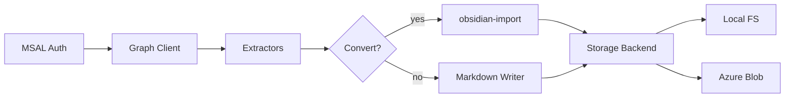

# m365-brain

[](https://github.com/neuralsignal/m365-brain/actions/workflows/ci.yml)
[](https://www.python.org/downloads/)
[](https://opensource.org/licenses/MIT)

Sync Microsoft 365 data to Obsidian-compatible markdown via the Graph API.

## Features

- **8 extractors**: Email, Calendar, Teams Chats, Teams Channels, OneDrive, SharePoint, Contacts, Directory
- **Delta sync** with pagination, exponential backoff retry, and rate limiting
- **2 storage backends**: local filesystem and Azure Blob Storage
- **Document conversion** via [obsidian-import](https://pypi.org/project/obsidian-import/) (PDF, DOCX, PPTX, XLSX to markdown)
- **MSAL device code authentication** with persistent token caching, and named auth profiles so several Entra apps coexist
- **Markdown index** — FTS5 full-text, vector and hybrid search, entity/relation traversal, and a catalog of the binary files it found
- **Write-back outbox** — typed intents gated by a per-outbox authority, dispatched and then reconciled against what Graph actually did
- **Strict Pydantic config** with no defaults, and environment variable expansion
- **CLI**: `init`, `auth login`, `run`, `extract`, `index`, `outbox`, `files`, `teams`, `vault`, `ops`, `status`
- **Bicep IaC** for Azure Storage (dev/prod parameter files)
- **Docker** + Docker Compose with Azurite profile for local development

## Installation

```bash
pip install m365-brain
```

Optional extras:

```bash
pip install m365-brain[azure]    # Azure Blob Storage backend
pip install m365-brain[convert]  # Document conversion (obsidian-import)
pip install m365-brain[admin]    # Reflex admin dashboard
pip install m365-brain[all]      # Everything
```

## Quick Start

### Write a config file and create the vault

```bash
m365-brain init config.yaml --vault ./vault
```

`init` writes the complete, commented configuration file and creates the vault directories. It refuses to overwrite an existing file. Every path it writes is absolute.

### Authenticate

```bash
m365-brain --config config.yaml auth login --profile mail
m365-brain --config config.yaml auth status --json
```

`--profile` names one of `auth.profiles` in the config; the shipped template defines `mail`, `chat` and `files`. Login opens a device code flow in your browser, and each profile caches its own token at the `token_cache_path` it names.

### Run one cycle

```bash
m365-brain --config config.yaml run --once
```

A cycle is extract → index → post-cycle hooks. `--once` runs every enabled unit whether or not its `poll_interval_minutes` says it is due; without it, `run` loops and honours the schedule.

### Run continuously

```bash
m365-brain --config config.yaml run
```

Each unit runs on its own `poll_interval_minutes`; the loop wakes every `service.continuous_poll_seconds`.

### Filter to some units

```bash
m365-brain --config config.yaml run --once --only email,calendar
```

### Search what was synced

```bash
m365-brain --config config.yaml index search "quarterly review" --json
m365-brain --config config.yaml index recent --timeframe 7d --json
```

Results go to **stdout**, logs to **stderr**, so `--json` output parses without being separated from log noise first. Any verb taking a `--limit` reports `total`, `returned` and `limit`, so a truncated answer is visible as one.

## Configuration

All configuration lives in one YAML file — or several, comma-separated and deep-merged left to right. Environment variables are expanded at load time using `${VAR_NAME}` syntax, and **a missing variable raises** rather than expanding to an empty string.

`m365-brain init` writes the reference configuration, whose comments *are* the documentation for every key. It is packaged at `m365_brain/templates/m365-brain.yaml`; the `config/` directory in this repo holds the split fragments the Docker images merge. Rather than restate it here — a copy that rots the first time a key moves — read the file `init` produced:

```bash
m365-brain --config config.yaml config validate
m365-brain --config config.yaml config show --json
```

`config validate` also resolves the configured hooks, which makes it a preflight rather than a syntax check. `config show` prints the effective merged config with secrets redacted.

Every section is strict: an unknown key is rejected, and no field anywhere has a default. A value the package needs is a value the config states.

### Environment variables

The config loader expands `${VAR_NAME}` references at load time. Required variables:

| Variable | Purpose |
|----------|---------|
| `MSAL_CLIENT_ID` | Azure AD app registration client ID |
| `MSAL_TENANT_ID` | Azure AD tenant ID |
| `AZURE_STORAGE_CONNECTION_STRING` | Connection string (Azure Blob backend only) |
| `AZURE_STORAGE_CONTAINER` | Container name (Azure Blob backend only) |
| `AZURE_STORAGE_PREFIX` | Blob prefix / virtual directory (Azure Blob backend only) |

## Azure Blob Storage

To use Azure Blob Storage instead of local filesystem, set `storage.backend: "azure_blob"` in your config. See `config/storage/azure_blob.yaml` for a complete example:

```yaml
storage:
  backend: "azure_blob"
  azure_blob:
    connection_string: "${AZURE_STORAGE_CONNECTION_STRING}"
    container_name: "${AZURE_STORAGE_CONTAINER}"
    prefix: "${AZURE_STORAGE_PREFIX}"
```

### Azurite (local development)

Start the Azurite emulator for local blob storage testing:

```bash
docker compose --profile azurite up -d
```

Then set the connection string to Azurite's default:

```bash
export AZURE_STORAGE_CONNECTION_STRING="DefaultEndpointsProtocol=http;AccountName=devstoreaccount1;AccountKey=Eby8vdM02xNOcqFlqUwJPLlmEtlCDXJ1OUzFT50uSRZ6IFsuFq2UVErCz4I6tq/K1SZFPTOtr/KBHBeksoGMGw==;BlobEndpoint=http://127.0.0.1:10000/devstoreaccount1;"
export AZURE_STORAGE_CONTAINER="m365-vaults"
export AZURE_STORAGE_PREFIX="dev"
```

## Infrastructure

Bicep templates in `infra/` provision an Azure Storage account with a private blob container. Parameter files for dev and prod are included.

### Deploy

```bash
# Dev
az deployment group create \
  --resource-group rg-m365extract-dev \
  --template-file infra/main.bicep \
  --parameters infra/params.dev.bicepparam

# Prod
az deployment group create \
  --resource-group rg-m365extract-prod \
  --template-file infra/main.bicep \
  --parameters infra/params.prod.bicepparam
```

The template creates:

- Storage account (`stm365ext{environment}`) in Switzerland North
- TLS 1.2 minimum, HTTPS only, no public blob access
- A single blob container (`m365-vaults` by default)

## Docker

### Full stack (local dev)

```bash
docker compose up --build            # web + postgres (daemon runs inside web)
docker compose --profile azurite up  # include Azurite blob emulator
```

## Development

```bash
git clone https://github.com/neuralsignal/m365-brain.git
cd m365-brain
pixi install
pixi run test        # unit tests (excludes integration + azurite markers)
pixi run test-cov    # unit tests with coverage
pixi run test-azurite  # tests requiring Azurite emulator
pixi run lint        # ruff check
pixi run format      # ruff format
pixi run pre-commit-install  # install git hooks
pixi run docs-serve  # local MkDocs dev server
```

### Project structure

```
m365-brain/
  m365_brain/
    config/            # Strict Pydantic config: loading, merge, env expansion
    model.py           # Entity / Observation / Relation and the query types
    parsers/           # Markdown and frontmatter into the model
    storage/           # StorageBackend protocol, local filesystem, Azure Blob
    state.py           # StateStore protocol; delta tokens, cursors, cycle history
    vault/             # Every path in the vault, plus the intent envelope
    outbox/            # Vendor-agnostic write-back: authorities, runner, reconcile
    index/             # The knowledge half -- backends, search, vectors, catalog
    m365/              # The Microsoft half -- Graph client, auth, extractors, outboxes
    cycle.py           # One cycle: extract, index, hooks
    cli.py             # Click CLI -- the whole operating surface
    commands/          # One module per command group
    workspace.py       # The library facade: a config path in, a working handle out
  m365_admin/          # Reflex admin dashboard (optional extra)
  skills/              # Bundled agent skills, thin wrappers over the CLI
  config/              # Config fragments the Docker images merge
  tests/               # pytest + hypothesis, mirroring the source layout
  infra/               # Bicep IaC for Azure Storage
```

`index/` never imports `m365/` and the two are peers by construction, so the knowledge layer works end to end on ordinary markdown with no Microsoft 365 present. That rule, the allowed directory list, the 300-line module cap, and the test-presence map are enforced by `scripts/check_structure.py` rather than by review.

## Architecture



**Graph Client** (`m365_brain/m365/client.py`) wraps `httpx` with automatic token refresh, exponential backoff on 429/5xx, and paginated response iteration. Each **extractor** under `m365_brain/m365/extractors/` calls Graph endpoints for its data source, renders markdown with YAML frontmatter through the builders in `m365_brain/m365/frontmatter/`, and persists through the **Storage Backend** interface. OneDrive and SharePoint extractors optionally route binary files through **obsidian-import** for document-to-markdown conversion.

**Sync state** tracks delta links and timestamps per unit through the `StateStore` protocol, written as JSON under the vault's meta directory. It is bookkeeping, not data: deleting it forces a full re-pull, never a data loss.

## Graph API Scopes

| Scope | Used by |
|-------|---------|
| `User.Read` | Token validation |
| `Mail.Read` | Email extractor |
| `Calendars.Read` | Calendar extractor |
| `Chat.Read` | Teams chats extractor |
| `ChannelMessage.Read.All` | Teams channels extractor |
| `Team.ReadBasic.All` + `Channel.ReadBasic.All` | Teams channels extractor — discovery mode only (`channels: null`); not needed with an explicit `channels` list |
| `Files.Read.All` | OneDrive + SharePoint extractors |
| `Sites.Read.All` | SharePoint extractor |
| `Contacts.Read` | Contacts extractor |
| `User.Read.All` | Directory extractor |
| `Directory.Read.All` | Directory extractor (manager chain, direct reports) |
| `offline_access` | Persistent token refresh |

All scopes use delegated (user) permissions via the device code flow. No application-level permissions are required.

## Releases

This project uses [Release Please](https://github.com/googleapis/release-please) for automated versioning and changelog generation. Commits following [Conventional Commits](https://www.conventionalcommits.org/) are parsed to determine version bumps.

## License

[MIT](LICENSE)
