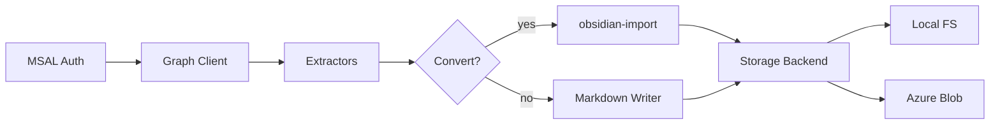

# m365-extract

[](https://github.com/neuralsignal/m365-extract/actions/workflows/ci.yml)
[](https://www.python.org/downloads/)
[](https://opensource.org/licenses/MIT)

Sync Microsoft 365 data to Obsidian-compatible markdown via the Graph API.

## Features

- **8 extractors**: Email, Calendar, Teams Chats, Teams Channels, OneDrive, SharePoint, Contacts, Directory
- **Delta sync** with pagination, exponential backoff retry, and rate limiting
- **2 storage backends**: local filesystem and Azure Blob Storage
- **Document conversion** via [obsidian-import](https://pypi.org/project/obsidian-import/) (PDF, DOCX, PPTX, XLSX to markdown)
- **MSAL device code authentication** with persistent token caching
- **Frozen dataclass config** with strict validation and environment variable expansion
- **CLI**: `auth login`, `sync --once`, `sync --continuous`
- **Bicep IaC** for Azure Storage (dev/prod parameter files)
- **Docker** + Docker Compose with Azurite emulator for local development

## Installation

```bash
pip install m365-extract
```

Optional extras:

```bash
pip install m365-extract[azure]    # Azure Blob Storage backend
pip install m365-extract[convert]  # Document conversion (obsidian-import)
pip install m365-extract[web]      # FastAPI web service mode
pip install m365-extract[all]      # Everything
```

## Quick Start

### Authenticate

```bash
m365-extract --config config.yaml auth login
```

This opens a device code flow in your browser. The token is cached at `state/token_cache.json` (configurable).

### Sync once

```bash
m365-extract --config config.yaml sync --once
```

### Sync continuously

```bash
m365-extract --config config.yaml sync --continuous
```

Each extractor runs on its own `poll_interval_minutes`. The scheduler checks every 30 seconds.

### Filter extractors

```bash
m365-extract --config config.yaml sync --once --extractors email,calendar
```

## Configuration

All configuration lives in a single YAML file. Environment variables are expanded at load time using `${VAR_NAME}` syntax.

```yaml
auth:
  client_id: "${MSAL_CLIENT_ID}"
  tenant_id: "${MSAL_TENANT_ID}"
  scopes:
    - "User.Read"
    - "Mail.Read"
    - "Calendars.Read"
    - "Chat.Read"
    - "ChannelMessage.Read.All"
    - "Files.Read.All"
    - "Sites.Read.All"
    - "offline_access"
  token_cache_path: "./state/token_cache.json"

service:
  mode: "cli"           # "cli" or "web"
  log_level: "INFO"

storage:
  backend: "local"      # "local" or "azure_blob"
  local:
    base_path: "./vault"

graph:
  max_retries: 3
  backoff_base_ms: 2000
  timeout_seconds: 30
  max_pages: 100

state:
  state_file_path: "./state/sync_state.json"

extractors:
  email:
    enabled: true
    poll_interval_minutes: 3
    folders: ["Inbox", "SentItems", "Archive"]
    lookback_days: 365
    max_items_per_sync: 500
  calendar:
    enabled: true
    poll_interval_minutes: 60
    lookback_days: 365
  teams_chats:
    enabled: true
    poll_interval_minutes: 5
    max_messages_per_chat: 200
  teams_channels:
    enabled: false
    poll_interval_minutes: 5
  onedrive:
    enabled: false
    poll_interval_minutes: 120
    eager_convert_patterns: []
    convertible_extensions:
      - ".docx"
      - ".pptx"
      - ".xlsx"
      - ".pdf"
      - ".csv"
      - ".txt"
      - ".md"
      - ".html"
    max_file_size_mb: 100
  sharepoint:
    enabled: false
    poll_interval_minutes: 240
    eager_convert_patterns: []
    convertible_extensions:
      - ".docx"
      - ".pptx"
      - ".xlsx"
      - ".pdf"
      - ".csv"
      - ".txt"
      - ".md"
      - ".html"
    max_file_size_mb: 100
  contacts:
    enabled: false
    poll_interval_minutes: 1440
  directory:
    enabled: false
    poll_interval_minutes: 10080

converters:
  backends:
    pdf: "markitdown"
    docx: "markitdown"
    pptx: "markitdown"
    xlsx: "markitdown"
    csv: "markitdown"
    json: "native"
    yaml: "native"
    image: "native"
    default: "native"
  extraction:
    timeout_seconds: 30
    max_file_size_mb: 100
    xlsx_max_rows_per_sheet: 500
  media:
    extract_images: false
    image_format: "png"
    image_max_dimension: 0
```

### Environment variables

The config loader expands `${VAR_NAME}` references at load time. Required variables:

| Variable | Purpose |
|----------|---------|
| `MSAL_CLIENT_ID` | Azure AD app registration client ID |
| `MSAL_TENANT_ID` | Azure AD tenant ID |
| `AZURE_STORAGE_CONNECTION_STRING` | Connection string (Azure Blob backend only) |
| `AZURE_STORAGE_CONTAINER` | Container name (Azure Blob backend only) |
| `AZURE_STORAGE_PREFIX` | Blob prefix / virtual directory (Azure Blob backend only) |

## Azure Blob Storage

To use Azure Blob Storage instead of local filesystem, set `storage.backend: "azure_blob"` in your config. See `config.azure.yaml` for a complete example:

```yaml
storage:
  backend: "azure_blob"
  azure_blob:
    connection_string: "${AZURE_STORAGE_CONNECTION_STRING}"
    container_name: "${AZURE_STORAGE_CONTAINER}"
    prefix: "${AZURE_STORAGE_PREFIX}"
```

### Azurite (local development)

Start the Azurite emulator for local blob storage testing:

```bash
docker compose -f docker-compose.dev.yaml up -d
```

Then set the connection string to Azurite's default:

```bash
export AZURE_STORAGE_CONNECTION_STRING="DefaultEndpointsProtocol=http;AccountName=devstoreaccount1;AccountKey=Eby8vdM02xNOcqFlqUwJPLlmEtlCDXJ1OUzFT50uSRZ6IFsuFq2UVErCz4I6tq/K1SZFPTOtr/KBHBeksoGMGw==;BlobEndpoint=http://127.0.0.1:10000/devstoreaccount1;"
export AZURE_STORAGE_CONTAINER="m365-vaults"
export AZURE_STORAGE_PREFIX="dev"
```

## Infrastructure

Bicep templates in `infra/` provision an Azure Storage account with a private blob container. Parameter files for dev and prod are included.

### Deploy

```bash
# Dev
az deployment group create \
  --resource-group rg-m365extract-dev \
  --template-file infra/main.bicep \
  --parameters infra/params.dev.bicepparam

# Prod
az deployment group create \
  --resource-group rg-m365extract-prod \
  --template-file infra/main.bicep \
  --parameters infra/params.prod.bicepparam
```

The template creates:

- Storage account (`stm365ext{environment}`) in Switzerland North
- TLS 1.2 minimum, HTTPS only, no public blob access
- A single blob container (`m365-vaults` by default)

## Docker

### Build

```bash
docker build -t m365-extract .
```

The image uses a multi-stage build (builder + slim runtime) and runs as a non-root user.

### Run

```bash
docker run --rm \
  -v $(pwd)/config.yaml:/app/config.yaml:ro \
  -v $(pwd)/state:/app/state \
  -v $(pwd)/vault:/app/vault \
  m365-extract --config config.yaml sync --once
```

## Development

```bash
git clone https://github.com/neuralsignal/m365-extract.git
cd m365-extract
pixi install
pixi run test        # unit tests (excludes integration + azurite markers)
pixi run test-cov    # unit tests with coverage
pixi run test-azurite  # tests requiring Azurite emulator
pixi run lint        # ruff check
pixi run format      # ruff format
pixi run pre-commit-install  # install git hooks
pixi run docs-serve  # local MkDocs dev server
```

### Project structure

```
m365-extract/
  m365_extract/
    auth/              # MSAL device code + token provider
    converters/        # Document conversion (obsidian-import bridge, HTML-to-markdown)
    extractors/        # One module per M365 data source
    storage/           # Storage backend interface + implementations
    web/               # FastAPI web service (optional)
    cli.py             # Click CLI entry point
    config.py          # Frozen dataclass config loader with env var expansion
    graph_client.py    # httpx-based Graph API client with retry + pagination
    markdown_writer.py # Markdown + YAML frontmatter serialization
    state.py           # JSON-backed sync state (delta tokens, timestamps)
  tests/               # pytest test suite (mirrors source layout)
  infra/               # Bicep IaC for Azure Storage
  config.yaml          # Local filesystem config (reference)
  config.azure.yaml    # Azure Blob Storage config (reference)
```

## Architecture



**Graph Client** wraps `httpx` with automatic token refresh, exponential backoff on 429/5xx, and paginated response iteration. Each **extractor** module calls Graph endpoints for its data source, transforms the response into markdown with YAML frontmatter via the **Markdown Writer**, and persists through the **Storage Backend** interface. OneDrive and SharePoint extractors optionally route binary files through **obsidian-import** for document-to-markdown conversion.

**Sync state** tracks delta links and timestamps per extractor in a JSON file, enabling incremental sync across runs.

## Graph API Scopes

| Scope | Used by |
|-------|---------|
| `User.Read` | Token validation |
| `Mail.Read` | Email extractor |
| `Calendars.Read` | Calendar extractor |
| `Chat.Read` | Teams chats extractor |
| `ChannelMessage.Read.All` | Teams channels extractor |
| `Files.Read.All` | OneDrive + SharePoint extractors |
| `Sites.Read.All` | SharePoint extractor |
| `offline_access` | Persistent token refresh |

All scopes use delegated (user) permissions via the device code flow. No application-level permissions are required.

## Releases

This project uses [Release Please](https://github.com/googleapis/release-please) for automated versioning and changelog generation. Commits following [Conventional Commits](https://www.conventionalcommits.org/) are parsed to determine version bumps.

## License

[MIT](LICENSE)
