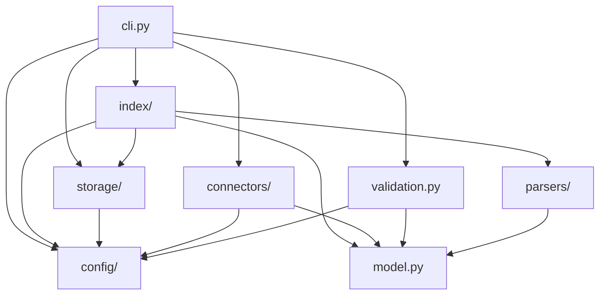

# Package Architecture

## Context

The knowledge system inherited from the consuming workspace lives in a single 1197-line module that handles parsing, database schema, connections, file catalog, vector search, chunking, and sync. This document decomposes it into well-bounded modules while adding configuration, CLI, and plugin support. In `m365_brain` the result is the `index/` half of the package, delivered by the knowledge-layer stage (ADR 0006).

The architecture must satisfy two competing constraints:

1. **CONSTITUTION compliance** — no defaults in runtime code, everything from config, fail fast
2. **Library usability** — `init` must produce a working config, `pip install` followed by a search must be a smooth experience

## Scope for v0.1

**In scope:**

- Module layout and import structure
- Core vs extras vs plugins split
- Configuration system (a YAML config file + Pydantic)
- Entry points: CLI, Python API, plugin registration
- Workspace root discovery
- Internal dependency direction

**Out of scope:**

- Individual module implementations (covered in docs 03-07)
- Deployment and packaging CI (see `08-github-actions.md`)

## Design

### Module Layout

The layout as designed, and how it lands inside `m365_brain`. Names in the right column are the
ones `scripts/check_structure.py` knows about; a module that is not in its `LAYERS` map is a
finding, so adding one is a deliberate act.

```
m365_brain/
├── __init__.py              # public surface
├── workspace.py             # the facade (was: a BrainWorkspace-style entry class)
├── config/                  # config file + Pydantic models
├── model.py                 # Entity, Observation, Relation dataclasses
├── parsers/
│   ├── __init__.py
│   ├── frontmatter.py       # YAML frontmatter parser
│   ├── observations.py      # Observation line parser + serializer
│   └── relations.py         # Relation + wikilink parser + serializer
├── index/
│   ├── __init__.py
│   ├── backends/base.py     # IndexBackend protocol
│   ├── backends/sqlite.py   # connection (WAL, busy_timeout), DDL, FTS5 query builder
│   ├── vector/base.py       # EmbeddingProvider + VectorStore protocols
│   ├── vector/…             # sqlite-vec, fastembed, hybrid search (optional)
│   └── sync.py              # markdown → index incremental sync
├── storage/
│   ├── base.py              # StorageBackend protocol
│   ├── local.py             # local filesystem
│   └── azure_blob.py        # Azure Blob
├── connectors/
│   ├── __init__.py          # Connector protocol + registry (entry points)
│   └── local.py             # Local filesystem connector
├── schemas/                 # Built-in YAML schema files
│   ├── person.yaml
│   ├── goal.yaml
│   ├── task.yaml
│   └── …
├── templates/               # Built-in entity templates
│   ├── person.md
│   ├── goal.md
│   └── …
├── validation.py            # Schema validation logic
└── cli.py                   # Click CLI
```

All module names are descriptive and project-specific per CONSTITUTION Section 3. No `src`, `lib`, `utils`, or `core`.

### Core vs Extras vs Plugins

#### Core (always installed)

| Module | Purpose | Dependencies |
|--------|---------|--------------|
| `config` | Configuration loading and validation | pydantic, pyyaml |
| `model` | Data classes for entities, observations, relations | (stdlib) |
| `parsers` | Markdown file parsing | pyyaml |
| `index.backends.sqlite` | Connection management, table creation, FTS5 text search | (stdlib sqlite3) |
| `index.sync` | File → index incremental sync | (stdlib) |
| `storage` | File access behind the `StorageBackend` protocol | (stdlib) |
| `connectors.local` | Local filesystem discovery | (stdlib) |
| `validation` | Schema validation | pyyaml |
| `cli` | CLI commands | click |

Core dependencies: `pyyaml`, `pydantic`, `click`

#### Extras (optional, `pip install m365-brain[extra]`)

| Extra | Modules Enabled | Dependencies | State |
|-------|-----------------|--------------|-------|
| `[convert]` | file extraction delegation | obsidian-import | present |
| `[azure]` | Azure Blob storage backend | azure-storage-blob | present |
| `[admin]` | multi-user admin UI | reflex, sqlmodel | present |
| `[vector]` | `index.vector` | fastembed, sqlite-vec | pending |
| `[export]` | PDF/DOCX export from the knowledge base | obsidian-export | pending |
| `[cloud]` | Cloud storage backends | s3fs, adlfs, gcsfs | pending |
| `[dev]` | Testing and linting | pytest, hypothesis, ruff | present |

#### Plugins (separate packages)

External packages register via `importlib.metadata` entry points:

```toml
# In a connector plugin's pyproject.toml
[project.entry-points."m365_brain.connectors"]
gdrive = "m365_brain_gdrive:GoogleDriveConnector"
```

### Configuration System

Configuration lives in a YAML config file — `m365-brain.yaml` by convention — at the workspace root.

```yaml
# m365-brain.yaml
index:
  roots:                       # the configured index roots, relative to this file
    - vault
  database_path: _meta/knowledge.db
  busy_timeout_ms: 30000

  file_extensions: [".md"]
  exclude_patterns: ["templates/*", "*.draft.md"]

  # Vector search settings (requires the [vector] extra)
  vector:
    enabled: false
    model: BAAI/bge-small-en-v1.5
    dimensions: 384
    chunk_size: 900
    chunk_overlap: 120
    batch_size: 50

# Storage settings (where the indexed files live)
storage:
  backend: local            # "local" | "azure_blob" | "s3" | "adls" | "gcs"
  # Cloud examples (requires the [cloud] extra):
  #   - s3://bucket/vault/
  #   - abfss://container@account.dfs.core.windows.net/vault/

# Connector settings
connectors:
  local:
    enabled: true
    watch_dirs: []              # additional directories beyond the index roots

# Schema settings
schemas:
  builtin: true                 # load built-in schemas
  custom_dir: null              # path to additional schema files
```

#### Config Loading

1. Look for the config file in CWD, then walk up to filesystem root
2. All relative paths resolve against the directory containing the config file
3. Environment variable overrides: `M365_BRAIN_*` (e.g., `M365_BRAIN_DATABASE_PATH`)
4. Missing config file is an error for all commands except `init`
5. Pydantic validates the config; invalid config crashes with a clear message

#### "No Defaults" Reconciliation

The CONSTITUTION mandates no default values in runtime code. For a library:

- **`init`** generates a complete config file with all values explicitly set. This is the only place where "recommended values" exist — in the init wizard, not in runtime code.
- **Runtime code** reads from the config file via Pydantic models. Missing required fields crash with validation errors.
- **Pydantic models** use `Field(...)` (required) for all fields, never `Field(default=...)`.
- **The config file itself** is the source of defaults. Code never invents values.

### Entry Points

#### CLI

```
m365-brain <command> [options]
```

Registered via `[project.scripts]` in pyproject.toml, with `mb` as a short alias. See `07-cli.md` for command details.

#### Python API

```python
from m365_brain.workspace import Workspace

workspace = Workspace.from_config("m365-brain.yaml")
results = workspace.search("my query", type="person")
entity = workspace.get_entity("people/john-doe")
```

The `Workspace` class is the primary public API. It wraps config loading, index connections, and search. Individual modules (`parsers`, `index`, `storage`) are also importable for advanced use.

#### Plugin Registration

Connectors register via entry points:

```python
from importlib.metadata import entry_points

def discover_connectors() -> dict[str, type]:
    eps = entry_points(group="m365_brain.connectors")
    return {ep.name: ep.load() for ep in eps}
```

A second entry point group is available for extractor plugins:

```toml
# In an extractor plugin's pyproject.toml
[project.entry-points."m365_brain.extractors"]
custom = "my_package:CustomExtractor"
```

### Workspace Root Discovery

The workspace root is the directory containing the config file. Discovery:

1. Start from CWD (or explicit `--config` path)
2. Walk up parent directories until the config file is found
3. If not found, error with message: "No config file found. Run `m365-brain init` to create one."

This is the same pattern used by git (`.git`), npm (`package.json`), and cargo (`Cargo.toml`).

### Internal Dependency Direction



Dependencies flow inward: CLI → modules → config/model. No circular dependencies. `model.py` and `config/` depend on nothing internal. `storage/` provides file access to both `index/` (for sync) and the CLI.

In `m365_brain` this graph is not a convention but a check: `scripts/check_structure.py` carries a layer number per subpackage, rejects upward and sideways imports, and rejects `index/` importing `m365/` as a same-layer violation. That last edge is the one that keeps the knowledge half independently useful.

## Decisions

### D-09: Config Format (YAML vs TOML)

- **Context:** The consuming workspace used YAML everywhere. The Python ecosystem favors TOML (pyproject.toml).
- **Options:**
  - A) YAML — supports complex nested structures, familiar to DevOps
  - B) TOML — Python standard, better type safety, less footgun-prone than YAML
  - C) Support both, auto-detect
- **Chosen:** A) YAML
- **Consequences:** Consistent with the knowledge model (YAML frontmatter) and the schema system (YAML). YAML's complexity risks (Norway problem, etc.) are mitigated by Pydantic validation. Users already work with YAML daily for frontmatter. `m365_brain` follows this: one or more YAML paths, deep-merged left to right, with `${VAR}` expansion that raises on a missing variable.

### D-10: "No Defaults" for a Library with an `init` Command

- **Context:** The CONSTITUTION says no defaults. But a library must be easy to start.
- **Options:**
  - A) Strict: every value must be user-provided, `init` asks for everything
  - B) Pragmatic: `init` generates config with recommended values, runtime code reads config strictly
  - C) Two-tier: library API requires all args, CLI provides config-based convenience
- **Chosen:** B) Pragmatic
- **Consequences:** `init` writes a complete config file with sensible starting values. Runtime Pydantic models have all fields required (no defaults). The config file is the single source of truth. The "no defaults" principle is satisfied: code never invents values, it reads them from config. The config file's initial values come from `init`, not from buried code defaults.

### D-11: Plugin Discovery Mechanism

- **Context:** Connectors (and potentially extractors) need a plugin system.
- **Options:**
  - A) `importlib.metadata` entry points — Python standard, works with pip
  - B) Config-based: list plugin module paths in the config file
  - C) File-system based: scan a `plugins/` directory
- **Chosen:** A) `importlib.metadata` entry points
- **Consequences:** Standard Python mechanism. Plugins install via pip and auto-register. No config changes needed. Works with all package managers (pip, uv, pixi). Entry point group: `m365_brain.connectors`. **Read against ADR 0012:** this plugin slot is for *file-discovery connectors*, not for additional SaaS sources — `m365_brain` deliberately has no source registry.

### D-12: Importable Subpackage Count

- **Context:** How many top-level importable modules should the package expose?
- **Options:**
  - A) Flat: everything at the top level (many modules)
  - B) Grouped: `parsers`, `index`, `connectors`, `storage`
  - C) Single facade: only the workspace class public, internals private
- **Chosen:** B) Grouped with public facade
- **Consequences:** `Workspace` is the primary public API for most users. Power users can import from subpackages directly. Internal modules use `_` prefix for truly private code. The grouped structure matches the module layout above, and `scripts/check_structure.py` makes the group list explicit.

## Resolved Questions

1. **Async support** — **Resolved:** Sync for v0.1. SQLite is not truly async; async wrapper deferred to v0.2 if demand exists.
2. **Pydantic v1 vs v2** — **Resolved:** v2 only. Pydantic v1 is EOL.

## References

- The retired index library: a single 1197-line module
- CONSTITUTION Section 3 (Architecture): descriptive names, modularity, composition
- CONSTITUTION Section 5 (Configuration): everything from config, no hardcoded paths
- CONSTITUTION Section 2 (No Default Arguments): no defaults in function signatures
- `scripts/check_structure.py` — the mechanical form of this document's layering rules
