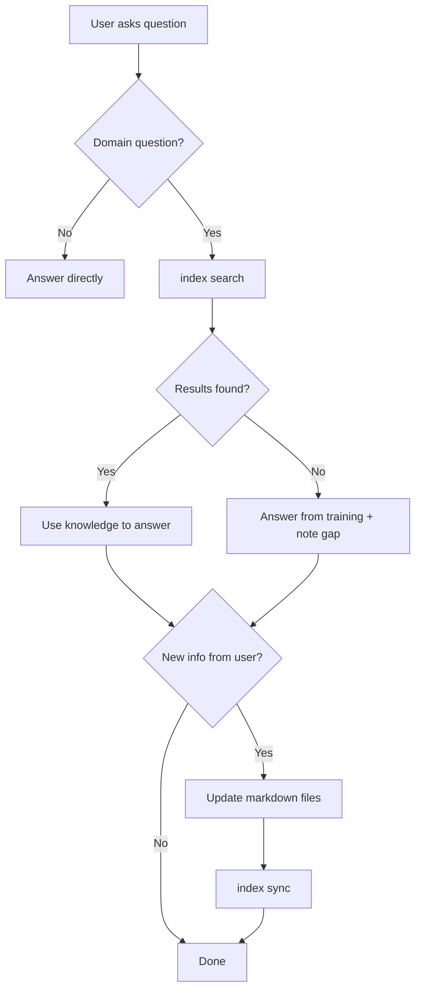

# Agent Integration

## Context

The most powerful feature of the system inherited from the consuming workspace is not the knowledge base itself, but how AI agents use it. A `search-first` rule ensures agents check knowledge before acting. Skills teach agents to search, navigate, and update the graph. Scheduled agents autonomously maintain knowledge quality.

This package bundles generalized versions of those rules and skills so users can give their AI assistants knowledge-aware behavior out of the box. An agentic engineering kit provides the structural conventions (rules, skills, agents, CONSTITUTION) that this integration follows. When `init --setup-agents` runs, it installs rules and skills that follow those conventions.

In `m365_brain` the bundled skills are `skills/{knowledge,files,ops}` — thin wrappers over the CLI and the `workspace.py` facade, delivered by the runtime stage. Their contract to an adopter (ADR 0008) is the same rule that governs this whole document: every threshold and rule a skill applies must be traceable to a config key. A skill that encodes a judgement call the operator cannot change does not ship.

## Scope for v0.1

**In scope:**

- Bundled rule: `search-first.md` (generalized)
- Bundled skill: the knowledge SKILL.md, adapted for the CLI
- Optional agents: `knowledge-gardener`, `docs-alignment-checker` (generalized templates)
- `init --setup-agents` to install rules/skills into user projects
- MCP server design for tool-use agents

**Out of scope:**

- Person-specific agents (inbox responders, style analysts, weekly summaries)
- An agent scheduling daemon — that stays with the consuming workspace
- Email-related agent workflows
- Operator policy of any kind: relationship-tier thresholds, triage rules, and note-type vocabularies belong to the configuring operator, not to this package (`INTENT.md` § Non-Goals)

## Design

### Bundled Rule: search-first

A generalized version of the consuming workspace's `search-first` rule. This rule is auto-loaded by agents and instructs them to search the knowledge base before acting on domain questions.

```markdown
---
description: Always search the knowledge base before answering domain questions
globs: ["**/*"]
---

# Search First

Before answering questions about people, projects, goals, tasks, decisions,
or domain knowledge, search the knowledge base:

1. `m365-brain index search "<relevant query>"` -- full-text search
2. `m365-brain index search --type <type> "<query>"` -- filtered by entity type
3. `m365-brain index context "<entity>"` -- get observations and relations

Only after searching (and finding no results) should you rely on your
training knowledge or ask the user.

When updating knowledge based on new information from the user:
- Update existing entity files rather than creating duplicates
- Add dated observations for new facts
- Create relations to connect new information to existing entities
```

Source: the consuming workspace's `search-first` rule, generalized to remove workspace-specific references

### Bundled Skill: knowledge

A SKILL.md that teaches agents how to use the CLI for knowledge operations:

```markdown
# knowledge

## Search
m365-brain index search "query"                    # full-text search
m365-brain index search --type person "name"       # type-filtered
m365-brain index search --search-type hybrid "q"   # hybrid FTS+vector
m365-brain index search --include-files "q"        # also search file catalog

## Navigate
m365-brain index context "Entity Name"             # observations + relations
m365-brain index context --depth 2 "Entity"        # multi-hop traversal
m365-brain index context --pattern "people/*"      # glob pattern match

## Extract
m365-brain extract --search "filename"             # find and extract a file
m365-brain extract --all-pending --limit 5         # batch extract

## Validate
m365-brain validate                                # check all files
m365-brain validate --type person                  # check specific type

## Sync
m365-brain index sync                              # incremental sync
m365-brain index sync --full-rebuild               # full rebuild
```

This replaces the consuming workspace's knowledge SKILL.md, whose commands were pixi-invoked scripts, with commands adapted for the packaged CLI.

### Optional Agent Templates

Generalized agent templates that users can install via `init --setup-agents`:

#### knowledge-gardener

An agent that periodically checks knowledge base health:

- Finds entities with missing required observations (per schema)
- Identifies unresolved relations (forward references that should be resolved)
- Flags stale entities (not updated in configurable timeframe)
- Reports duplicate or near-duplicate entities
- Suggests relation connections between loosely connected entities

Runs via the user's preferred scheduling mechanism (cron, an external agent scheduler, CI).

#### docs-alignment-checker

An agent that verifies documentation consistency:

- Checks that README/CLAUDE.md references match actual file paths
- Verifies that documented commands actually work
- Flags outdated status in roadmap/status docs
- Reports broken wikilinks in markdown files

### `init --setup-agents`

When invoked with `--setup-agents`, `init` additionally:

1. Copies `search-first.md` to `rules/` (or `.cursor/rules/` or `.claude/rules/` based on detected tooling)
2. Copies the knowledge SKILL.md to `skills/knowledge/` (or equivalent)
3. Copies agent templates to `agents/` (or equivalent)
4. Detects project structure and installs accordingly:
   - If `.cursor/` exists → install to `.cursor/rules/` and `.cursor/skills/`
   - If `.claude/` exists → install to `.claude/rules/` and `.claude/skills/`
   - If an agentic-engineering-kit structure is detected (CONSTITUTION.md, `rules/`, `skills/`) → install alongside existing rules/skills
   - Otherwise → create `rules/` and `skills/` at workspace root
5. Generates the config file with agent-friendly starting values (if not already present)

### Agentic-Engineering-Kit Integration

The [agentic-engineering-kit](https://github.com/anthropics/agentic-engineering-kit) provides templates for rules, skills, and agents. This package ships rules and skills that follow the kit's conventions:

**Kit compatibility:**

- Rules use the kit's YAML frontmatter format (`description`, `globs`)
- Skills use the kit's SKILL.md format (YAML frontmatter with `name` + `description`, progressive disclosure sections)
- Agent templates follow the kit's agent format (detailed prompts with tool allowlists)
- `init --setup-agents` detects kit-structured projects and installs into the right directories

**What this package adds to a kit project:**

- `search-first` rule — auto-loaded, instructs agents to search knowledge before acting
- the knowledge skill — teaches agents the CLI commands
- Agent templates (knowledge-gardener, docs-alignment-checker) — optional, copied on request
- a config file — workspace config for knowledge management

**What this package does NOT replace:**

- The kit's CONSTITUTION.md (this package has no opinion on engineering standards)
- The kit's dark factory workflows (this package adds knowledge-specific CI actions, not general CI)
- The kit's rules or skills (this package's rules/skills are additive)

### MCP Server

An optional MCP (Model Context Protocol) server that exposes knowledge operations as tools for LLM agents:

```python
# Potential MCP tool definitions
tools = [
    {
        "name": "index_search",
        "description": "Search the knowledge base",
        "parameters": {
            "query": {"type": "string", "required": True},
            "type": {"type": "string"},
            "limit": {"type": "integer"},
        }
    },
    {
        "name": "index_context",
        "description": "Get entity observations and relations",
        "parameters": {
            "entity": {"type": "string", "required": True},
            "depth": {"type": "integer"},
        }
    },
    {
        "name": "extract",
        "description": "Extract and index a file",
        "parameters": {
            "query": {"type": "string", "required": True},
        }
    },
]
```

The MCP server wraps the Python API (the `Workspace` facade) and exposes it over stdio or SSE transport. This allows tool-use agents to query the knowledge base without shelling out to CLI commands.

**v0.1 scope:** Design only. Implementation deferred to v0.2 unless demand is high. The CLI + agent skill approach covers most use cases for v0.1.

### Integration Patterns

#### Pattern 1: CLI via Agent Rules/Skills

The simplest integration. The agent uses shell tools to call CLI commands:

```
Agent → shell → m365-brain index search "query" → JSON output → Agent
```

Works with any agent that can execute shell commands.

#### Pattern 2: MCP Server

For agents that support MCP tool use:

```
Agent → MCP protocol → MCP server → Python API → Agent
```

Lower latency (no shell overhead), structured tool definitions, better error handling.

#### Pattern 3: Python API

For custom agent implementations:

```python
from m365_brain.workspace import Workspace

workspace = Workspace.from_config("m365-brain.yaml")

# In agent tool handler
def search_knowledge(query: str, type: str | None) -> list[dict]:
    return workspace.search(query, type=type)
```

Note the signature: no default argument. `type` is passed explicitly, even when it is `None`.

### Agent Workflow: Search-First Pattern

The recommended workflow for knowledge-aware agents:



## Decisions

No new decision IDs for this document. Key decisions are:

- D-04 (relationship to a kit): Complementary, not dependent. Rules/skills ship with the package but follow kit conventions.
- D-11 (plugin discovery): an MCP server could register via entry points too.
- ADR 0008 (skills ship with the package): the bundled skills are part of the distribution, and every threshold they apply traces to a config key.

## Resolved Questions

1. **MCP transport** — stdio for v0.1. SSE deferred to v0.2.
2. **Rule auto-detection** — Yes. `init --setup-agents` detects Cursor, Claude Code, and kit structures automatically.
3. **Agent scheduling** — Not included. Users bring their own scheduler (cron, an external agent scheduler, GitHub Actions).
4. **Knowledge update protocol** — Agents edit markdown files directly. `index sync` handles validation and indexing. The package never rewrites markdown it did not produce.

## References

- The consuming workspace's `search-first` rule
- The consuming workspace's knowledge skill and agent templates (knowledge-gardener, docs-alignment-checker)
- agentic-engineering-kit conventions: <https://github.com/anthropics/agentic-engineering-kit>
- MCP specification: <https://modelcontextprotocol.io/>
- Claude Code MCP: <https://docs.anthropic.com/en/docs/claude-code/mcp>
- ADR 0008 — skills ship with the package
