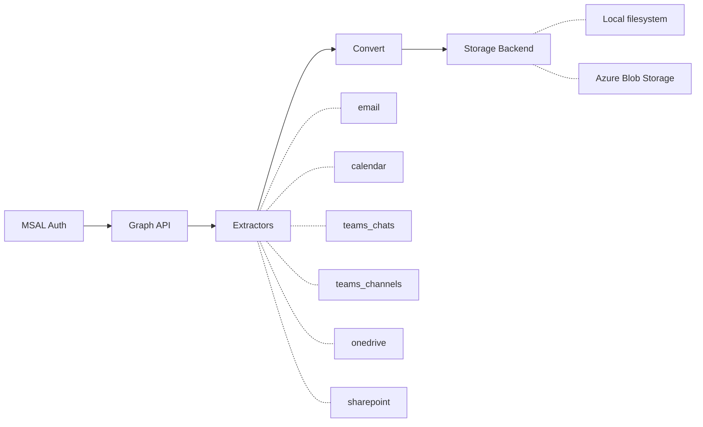

# m365-extract

Sync Microsoft 365 data to Obsidian-compatible markdown via the Graph API.

## Features

- **6 extractors** -- email, calendar, Teams chats, Teams channels, OneDrive, SharePoint
- **Delta sync** -- incremental updates via Graph API delta queries; only fetches what changed
- **2 storage backends** -- local filesystem or Azure Blob Storage
- **Document conversion** -- convert Office documents (DOCX, PPTX, XLSX, PDF) to markdown via [obsidian-import](https://github.com/neuralsignal/obsidian-import)
- **MSAL authentication** -- device code flow with automatic token caching and refresh
- **Config-driven** -- single `config.yaml` controls all behavior; environment variable expansion for secrets
- **CLI** -- `m365-extract auth login`, `sync --once`, `worker`
- **Docker** -- Single Dockerfile (multi-stage, non-root); Docker Compose with Azurite profile for local dev
- **Bicep IaC** -- Azure Storage Account deployment templates for dev and prod

## Quick Example

```bash
# Authenticate
m365-extract --config config.yaml auth login

# Run all enabled extractors once
m365-extract --config config.yaml sync --once

# Run multi-user sync worker (per-extractor jobs)
m365-extract --config config/base.yaml,config/auth.yaml,config/service/web.yaml worker
```

## Pipeline



The pipeline authenticates via MSAL device code flow, queries Microsoft Graph API v1.0, runs each enabled extractor to fetch and convert data, then writes Obsidian-compatible markdown files to the configured storage backend.

## Output Format

Every synced item produces a markdown file with YAML frontmatter containing metadata (sender, date, participants, file size, etc.) and a body with the converted content. Files are organized in a directory structure designed for Obsidian vault consumption:

```
vault/
  emails/2026/2026-03-15/meeting-recap-a1b2c3/index.md
  calendar/2026/2026-03/2026-03-15-standup-d4e5f6.md
  teams-chats/project-alpha_g7h8i9.md
  teams-channels/engineering/general-j0k1l2.md
  onedrive/Documents/report.docx.md
  sharepoint/intranet/shared-docs/handbook.docx.md
```

## License

MIT
